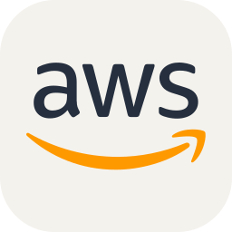
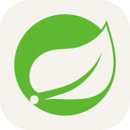
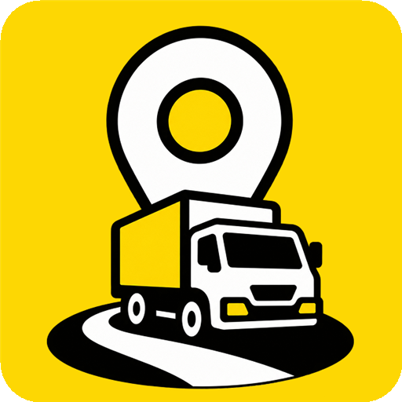
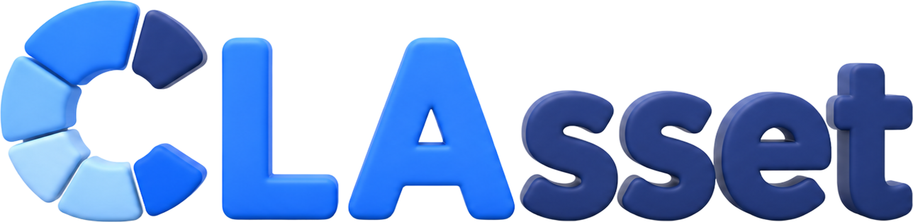

# 서현식

### 개발·배포·운영을 연결합니다.

개발한 기능이 서버에서 동작하고, 문제가 생겼을 때 원인을 찾을 수 있도록 구현과 배포·운영을 연결해 왔습니다.

[포트폴리오](https://dorian-insect-dbd.notion.site/3d7f9416d0c981e09550c74daf722192) · [약력](#약력) · [수상](#수상) · [프로젝트](#프로젝트) · [사용 기술](#사용-기술) · [이메일](mailto:hyunsik971107@gmail.com)

## 약력

| 기간 | 이력 |
|---|---|
| 2026.01 ~ 현재 | **삼성청년SW·AI아카데미 15기 · Java 트랙** · 1학기 이수, 2학기 재학 |
| 2024.09 ~ 2025.11 | **이시스코스메틱 · 품질관리팀 연구원** · 원부자재·제품 시험 및 품질관리 |
| 2016.03 ~ 2022.02 | **한양대학교 ERICA · 재료화학공학과 졸업** |

## 수상

| 시기 | 수상 내역 | 프로젝트 |
|---|---|---|
| 2026.09 | **MOVE AI CHALLENGE 2026 · 물류산업진흥재단 이사장상** | 길벗 · 팀장, 기획·담당 구현·통합 |
| 2026.08 | **2026년 물류데이터·AI 활용 및 분석 아이디어 공모전 · 최우수상** | 철들었조 · 데이터 수집·결합, 서비스 화면 설계 |
| 2026.08 | **SSAFY 공통 프로젝트 웹기술 트랙 · 우수상** | Veil · 인프라 |

세 수상은 모두 팀 수상입니다. MOVE AI CHALLENGE는 2026.09.01 수상 확정 안내 기준이며, 2026.09.11 현재 상장 수령 전입니다.

**공개 코드 바로 보기** · [길벗: 기획·담당 구현·통합](https://github.com/Crew-97/gilbeot) · [CSFriends: RAG 백엔드](https://github.com/Crew-97/CSFriends)

## 사용 기술

**배포·운영**

EC2·Docker Compose·Jenkins·Nginx로 서버와 자동 배포를 구성했습니다.

**관찰·문제 대응**

Prometheus·Grafana·Loki로 메트릭과 로그를 확인하고 운영 알림을 연결했습니다.

**백엔드·화면 구현**

Python·FastAPI로 문서 검색 API를 구현하고, Vue 화면 구현과 지도 연동을 경험했습니다. Java·Spring은 학습하며 프로젝트에 적용하고 있습니다.

## 프로젝트

###  01. Veil
익명 화상 인터뷰 서비스 · **인프라**

EC2·Docker Compose·Jenkins 배포를 맡아 필수 설정 검사, 로그·메트릭 수집과 알림을 구성했습니다.

[배포 전 검사와 운영 관찰](https://dorian-insect-dbd.notion.site/3d7f9416d0c981c786c9f86e8fde186b) · 팀 코드와 운영 원문은 접근 제한 자료입니다.

###  02. [길벗](https://github.com/Crew-97/gilbeot)
화물기사 경험 공유 시제품 · **팀장 · 기획 · 구현·통합**

팀 작업의 기준 문서를 작성하고, 담당 기능 구현과 PR 통합을 수행했습니다. AI 구현은 팀원 기여와 구분합니다.

[서비스 화면과 역할](https://github.com/Crew-97/gilbeot#서비스-화면과-개인-기여) · [통합 사례](https://github.com/Crew-97/gilbeot/pull/13)

### 📘 03. [CSFriends](https://github.com/Crew-97/CSFriends)
기술 문서 기반 RAG 챗봇 · **백엔드**

기존 스켈레톤에 문서 분할·검색·답변 생성·업로드 흐름을 연결했습니다.

[백엔드 코드](https://github.com/Crew-97/CSFriends/blob/main/servers/main.py) · [수행 기록](https://github.com/Crew-97/CSFriends/blob/main/REPORT.md)

###  04. 클라셋
투자 학습 서비스 · **인프라 · 기획 · 일부 백엔드** · 진행 중

앱 DB 계정 분리, 배포 상태 기록과 복구 판단을 정리하고 있습니다. 구현된 코드와 운영 기록을 구분해 확인합니다.

[배포 상태 기록과 복구 판단](https://dorian-insect-dbd.notion.site/3d7f9416d0c98165a9a1cc345504fe69)

###  05. 안심식탁
알레르기 정보를 고려한 외식 정보 서비스 · **프론트엔드 · 인프라**

Vue 화면 15개와 지도 연동, 비회원 이용 흐름을 구현하고 EC2·RDS·Docker Redis 배포 환경을 구성했습니다.

[실제 화면과 개인 역할](https://dorian-insect-dbd.notion.site/3d7f9416d0c981dc8e8ae4c6ddd12ec0)

## 학습 기록

[알고리즘 풀이](https://github.com/Crew-97/algorithm) · [Spring 의존성 주입 실습](https://github.com/Crew-97/HyunsikSpring) · [Spring MVC 요청·응답 실습](https://github.com/Crew-97/JSB)

각 저장소에 학습 주제와 코드를 읽는 순서를 정리했습니다.

---

[이메일](mailto:hyunsik971107@gmail.com) · Technology icons by [Skill Icons](https://github.com/tandpfun/skill-icons)
